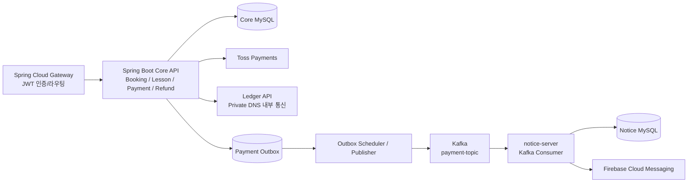

# Lesson Platform Backend

레슨 탐색부터 신청, 결제·환불, 예약 상태 변경, 결제 완료 알림까지 이어지는 **레슨 매칭 플랫폼의 핵심 도메인 서버**입니다.

단순 CRUD 구현에 그치지 않고, 다음 문제를 중심으로 설계했습니다.

- 레슨 유형에 따라 달라지는 재고와 시간 자원 선점
- 결제·예약·원장·이벤트 사이의 데이터 정합성
- 외부 결제/원장 API 장애와 중복 요청
- 결제 API와 비동기 알림 시스템의 책임 분리

## Project Context

```text
Frontend → Gateway → Backend Core API → Toss Payments / Ledger
                                  └────→ Payment Outbox → Kafka → notice-server → FCM
```

이 저장소는 `Booking`, `Lesson`, `Payment`, `Refund`, `Review` 등 핵심 도메인의 API와 상태 전이를 담당합니다.

| Repository | Responsibility |
| --- | --- |
| `lesson-platform-backend` | 회원, 레슨, Booking, 결제/환불, 리뷰 핵심 API |
| `gateway` | JWT 인증, 라우팅, 내부 사용자 컨텍스트 전달 |
| `notice-server` | Kafka 결제 이벤트 소비, 사용자 알림, FCM 발송 |
| `lesson-platform-infra` | Terraform 기반 GCP 인프라와 운영 환경 |

## My Contribution

백엔드 중심으로 다음 영역을 설계·구현했습니다.

- Booking 생성과 레슨 유형별 재고 차감·복구
- 멘토링 시간대 중복 선점 방지
- Toss 결제 승인, 결제 상태·이력 관리, 환불 흐름
- Payment와 Booking, Ledger, Outbox 사이의 성공 조건 설계
- Ledger HTTP Client와 Timeout·Retry·Circuit Breaker 적용
- Transactional Outbox와 Kafka 이벤트 발행 흐름
- 환불 후 Booking 취소·재고 복구 동시성 제어
- Gateway·notice-server·Terraform/GCP 인프라 연동

## Core User Flow

```text
레슨 신청
→ Booking 생성 및 레슨 유형별 자원 선점
→ Payment checkout 및 결제 금액 스냅샷 저장
→ Toss 결제 승인
→ Ledger 원장 기록
→ Payment SUCCESS / Booking APPROVAL_PENDING / Outbox READY 저장
→ Outbox Scheduler/Publisher가 Kafka payment-topic 발행
→ notice-server 이벤트 소비
→ 알림 설정·FCM token 조회
→ 결제 완료 알림 발송
```

### Synchronous and Asynchronous Boundary

결과를 즉시 확정해야 하는 단계와 지연·재처리가 가능한 단계를 분리했습니다.

- **동기:** Booking 생성·재고 선점, Payment checkout, Toss 승인, Ledger 기록, Payment/Booking 상태 확정
- **같은 트랜잭션:** Payment `SUCCESS`, PaymentHistory, `PAYMENT_COMPLETED` Outbox `READY` 저장
- **비동기:** Outbox 발행, Kafka 소비, 알림 설정 조회, FCM 발송

이를 통해 결제 요청이 알림 서버나 FCM 처리 속도에 묶이지 않도록 하면서도, 결제 완료 이벤트의 유실 가능성을 줄였습니다.

## Key Engineering Problems

### 1. 레슨 유형별 재고와 멘토링 시간 선점

레슨의 “재고”가 모든 유형에서 같은 의미를 갖지 않는 문제를 먼저 정의했습니다.

- `ONEDAY`: 선택한 시간대의 잔여 수량
- `STUDY`: 레슨 단위의 수량
- `MENTORING`: 정해진 좌석이 아니라 특정 멘토의 시간 구간 점유

`BookingStockService`에 유형별 차감·복구 책임을 모으고, 멘토링은 `mentorId`와 시작·종료 시간의 겹침을 조회해 중복 신청을 차단했습니다.

```text
existing.startTime < requested.endTime
AND existing.endTime > requested.startTime
```

결제 진행 중인 예약도 시간대를 점유하도록 `PAYMENT_PENDING`, `APPROVAL_PENDING`, `APPROVED` 상태를 점유 상태로 정의했습니다. 이를 통해 단순 수량 차감으로 표현할 수 없는 시간 자원 예약을 별도 도메인 규칙으로 모델링했습니다.

### 2. 결제 성공의 기준과 다중 도메인 정합성

처음에는 Toss 승인 성공을 내부 결제 성공으로 연결할 수 있었지만, 결제 성공 이후 Ledger 기록이나 Booking 후속 처리가 실패하면 도메인 간 상태가 어긋날 수 있었습니다. 이에 결제 성공을 하나의 Payment 상태가 아니라 다음 조건이 함께 만족되는 상태로 재정의했습니다.

```text
Toss 승인 성공
AND 저장된 Payment 금액 == PSP 응답 금액
AND Ledger 원장 기록 성공
→ Payment SUCCESS
→ Booking APPROVAL_PENDING
→ PAYMENT_COMPLETED Outbox READY
```

핵심 정책:

- Ledger 요청 금액은 Toss 응답이 아니라 checkout 시 저장된 Payment 금액을 기준으로 사용
- PSP 금액과 DB Payment 금액이 다르면 Ledger와 후속 처리를 진행하지 않고 `UNKNOWN`
- Ledger 요청에는 `PAYMENT:{paymentId}:COMPLETED` idempotency key 사용
- Ledger 성공 이전에는 Booking 완료와 `PAYMENT_COMPLETED` 이벤트 발행을 차단

### 3. 외부 Ledger 장애 허용성

외부 API 장애를 단순 예외 처리로 끝내지 않고, 장애 종류와 고객 영향에 따라 정책을 나눴습니다.

| Policy | Decision |
| --- | --- |
| Timeout | connect 1초, read 3초로 외부 대기 제한 |
| Retry | 네트워크 오류와 5xx만 최초 요청 포함 최대 2회 재시도 |
| 4xx | 요청 자체의 오류 가능성이 높아 재시도하지 않음 |
| Idempotency | 재시도에 따른 중복 원장 기록 방지 |
| Circuit Breaker | 반복 장애 시 Ledger 호출을 차단하고 Payment를 `UNKNOWN` 처리 |

Ledger 성공 전에는 Payment `SUCCESS`, Booking 완료, 결제 완료 이벤트가 발생하지 않는 계약을 테스트로 검증했습니다.

### 4. 환불 후 Booking 취소와 재고 복구

PG 환불이 성공해도 내부 Booking 취소나 재고 복구가 실패할 수 있습니다. 이미 외부 환불이 완료된 뒤에는 PG 환불을 되돌릴 수 없으므로, 내부 상태 복구와 중복 실행 방어가 필요했습니다.

- 환불 실행과 내부 상태 변경을 분리하고, 실패·불명확 상태는 재처리 대상으로 관리
- Booking row를 `PESSIMISTIC_WRITE`로 잠가 최초 `CANCELED` 전이와 재고 복구 호출을 직렬화
- Stock 수량 변경은 원자적 update로 처리
- 이미 `CANCELED`인 Booking은 재고를 다시 복구하지 않는 멱등 동작 유지

즉, “취소 여부”는 Booking이 판단하고 “수량 변경의 원자성”은 Stock DB update가 책임지도록 경계를 나눴습니다.

## Architecture



### Infrastructure

- Terraform으로 GCP 기반 Core API, Gateway, notice-server, Kafka, MySQL 구성 관리
- GCP Secret Manager를 통한 DB·Kafka·JWT·Toss 관련 운영 시크릿 분리
- Private DNS 기반 Backend → Ledger 내부 통신 구조
- Prometheus/Grafana와 ELK 기반 운영 관측성 구성

실제 GCP 환경의 Private DNS 호출 검증과 세부 운영 지표 설계는 별도 통합 테스트·운영 과제로 관리하고 있습니다.

## Domain Responsibilities

| Domain | Responsibility |
| --- | --- |
| `Booking` | 예약 생성, 결제 완료 후 상태 전이, 승인·취소 command |
| `Schedule` | 예정/지난 일정, 캘린더 등 조회/read 관점 |
| `BookingStockService` | 레슨 유형별 재고 차감·복구와 시간 자원 정책 |
| `Payment` | checkout, Toss 승인, 결제 상태·이력 |
| `Refund` | 환불 요청, PG 환불 실행, 재시도·내부 상태 복구 |
| `PaymentOutbox` | 결제 완료 이벤트 저장·발행 상태·재시도 |

## Test Coverage

현재 핵심 흐름과 실패 경로를 다음 테스트로 검증하고 있습니다.

- 결제 성공, 실패, timeout, DB 저장 실패, 중복 confirm
- Ledger 성공·5xx·timeout·Circuit Open 처리
- 저장된 Payment 금액과 PSP 응답 금액 불일치
- Ledger 실패 시 Payment/Booking/Outbox 후속 처리 차단
- Payment Outbox 발행과 다중 인스턴스 claim 경쟁
- 환불 성공 후 Booking 취소·재고 복구
- Booking 취소 동시성 및 재고 중복 복구 방지
- 레슨 유형별 Booking command와 멘토링 시간 중복 검증

빠르게 핵심 결제 테스트를 실행하려면:

```bash
./gradlew test \
  --tests 'com.kosa.fillinv.payment.service.PaymentServiceTest' \
  --tests 'com.kosa.fillinv.payment.client.LedgerClientRetryTest' \
  --tests 'com.kosa.fillinv.payment.client.TossPaymentClientRetryTest' \
  --tests 'com.kosa.fillinv.payment.client.TossPaymentClientTest'
```

전체 테스트:

```bash
./gradlew test
```

## Tech Stack

`Java 21` · `Spring Boot` · `Spring MVC` · `Spring Data JPA/JDBC` · `Spring Security` · `MySQL` · `Kafka` · `Spring Retry` · `Resilience4j` · `Spring Cloud Gateway` · `JWT` · `Flyway` · `Terraform` · `GCP Secret Manager`
